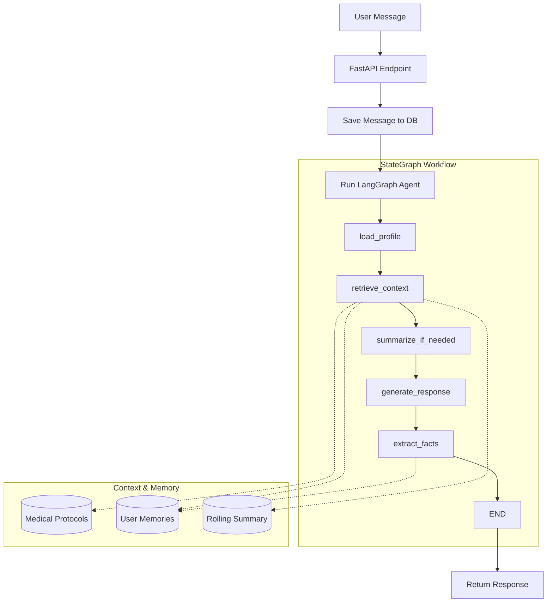

# AI Health Coach


# How to run it locally

```bash
# run model
ollama pull llama3.2
ollama run llama3.2

# run backend
cd backend
uv sync
uv run main.py

# run frontend
cd frontend
bun install
bun --bun next dev
```

## Backend Architecture

The backend is built using a **LangGraph** agentic workflow, designed to handle complex health conversations with stateful context management.

### Agent Flow & Context Building

When a user sends a message, the system follows this structured flow to build context and generate a response:

1.  **Entry (FastAPI)**: The `/chat/message` endpoint saves the user's message and initializes the LangGraph agent.
2.  **Load Profile**: The `load_profile` node fetches the user's display name, age, and biological sex for personalized guidance.
3.  **Context Building (RAG)**: The `retrieve_context` node performs several key actions:
    -   **Keyword Extraction**: Analyzes the user's message for symptoms (e.g., "headache", "fever").
    -   **Protocol Matching**: Searches the database for relevant medical protocols based on extracted keywords.
    -   **Long-term Memory**: Retrieves past health facts (e.g., "allergic to ibuprofen") from the `UserMemoryFact` table.
4.  **Rolling Summary**: The `summarize_if_needed` node checks for older messages. If the conversation is long, it creates or updates a rolling summary to maintain history without exceeding context windows.
5.  **Response Generation**: The `generate_response` node constructs a detailed system prompt using the user profile, medical protocols, health history, and rolling summary. It uses the last 4 messages for immediate conversational context.
6.  **Fact Extraction**: After responding, the `extract_facts` node periodically analyzes the latest interaction to identify and save new health facts to the user's long-term memory.

### Flowchart


## LLM Provider

I used llama3.2:3b parmaeters which was run by ollama , it was easy to inference locally , it is an slm but I have added context handling checks and methods to make it more comparable to real world use case.

## Tradeoffs 

- CTA(call to action): for severe issues it should prompt the user to consult a doctor which could be directed to a scheduling software internally 
- Semantic search instead of static search , right now the agent is doing static search for keyword identification with more time i would add semantic search to get better intent and match with protcols.
- Vector db (Ideally the agent should search over a vector db with a query for context retrival per user as user's health concerns grow or more content is added like medical prescriptions (which could be parsed with ocr models), right now it's stored in db) , also pairing it up with semantic search.
- Pragmatic nomeclature and code (my focus was majorly to make it functional , code should be more prgramatic further on , used llms to generate right now)
- Use cache for agent state , right now we are pulling agent state every time based on users query but it could be stored in cache for quick retrieval in production as users state updates also it could be flushed after a timeout , it will reloaded after a user starts a session basically reducing db calls for read but writes would have to be done.
- Fact checking and content filtering : the agent should reject symptoms that seem to be wrong or not necessarily valid for the user , like someone can say they have aids they should pick that up during a conversation or do quizzes in between to verify that a particular issue has been cured flag it as not active.
- notifications: if user reported a severe issue or the agent suggested a health checkup , it should add to queue to do a quick health quiz with maybe AWS SNS for the symptoms they shared in particular , because the agent state could become corrupted due to that
